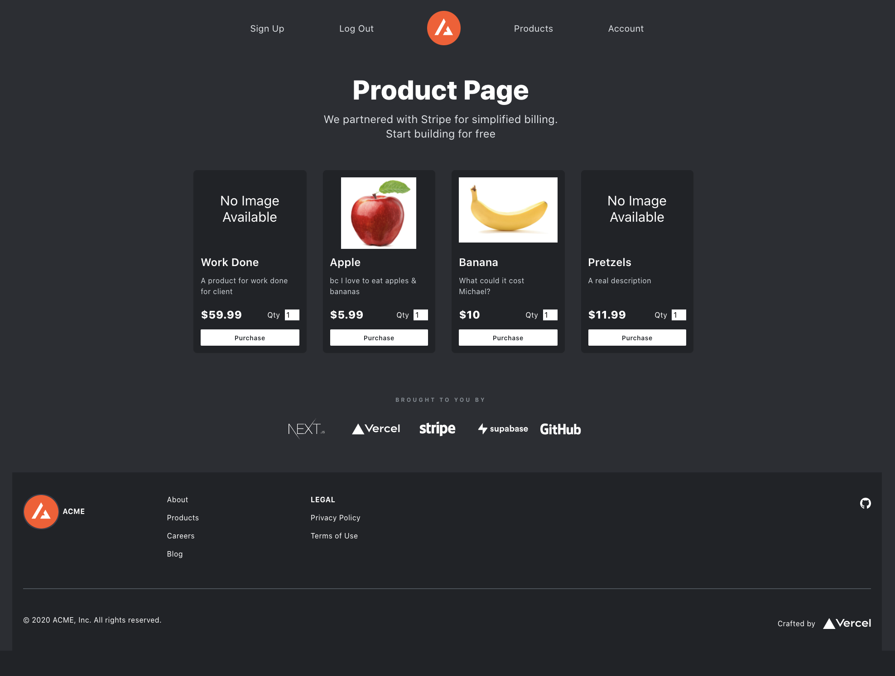
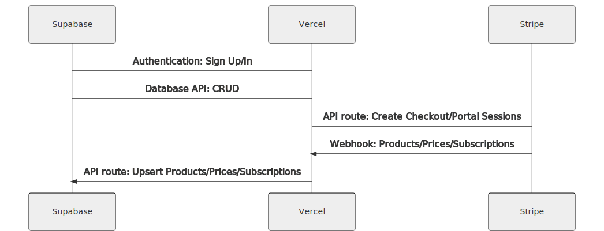

# Next.js Subscription Payments Starter

The all-in-one starter kit for high-performance SaaS applications. With a few clicks, Next.js developers can clone, deploy and fully customize their own SaaS one-off purchases application.

## Features

- Secure user management and authentication with [Supabase](https://supabase.io/docs/guides/auth).
- Powerful data access & management tooling on top of PostgreSQL with [Supabase](https://supabase.io/docs/guides/database).
- Integration with [Stripe Checkout](https://stripe.com/docs/payments/checkout) and the [Stripe customer portal](https://stripe.com/docs/billing/subscriptions/customer-portal), all plumbing already set up.
- Automatic syncing of products via [Stripe webhooks](https://stripe.com/docs/webhooks).

## Demo

- https://nextjs-subscription-payments-starter.vercel.app/

[](https://nextjs-subscription-payments-starter.vercel.app/)

## Architecture



## Setup

### 1. Create new Supabase project

Sign up to Supabase - [https://app.supabase.io](https://app.supabase.io)  
Select 'new project'  
Choose organization - If this is your first time using Supabase, you'll have to select and set up 'New organization'  
Determine 'Name' and 'Password' select 'Next'  
Wait for your database to setup and start

### 2. Set up your database tables and auth policies

In your Supabase dashboard, go to the SQL editor  
Click on '+' in the upper right area, adding a new 'Query' tab  
Copy the content from the `schema.sql` file in your repo directly into this tab  
Inside of this tab, mid to lower right on screen, select 'RUN' button

- When 'RUN' has completed, you should see the message 'Success. No rows returned' in 'Results' area
- You can check your 'Table Editor' tab and click on the table icon to make sure that your tables have been created (Or check same by navigating to 'Database' tab and selecting 'Tables')

#### [Optional] - Set up OAuth providers

You can use third-party login providers GitHub, Google, Gitlab or Bitbucket. Refer to the [docs](https://supabase.io/docs/guides/auth#third-party-logins) to learn how to configure these. We have given Google & Github examples below.

##### Google OAuth 2.0 example:

Go to Google API's & Services / Dashboard page [here](https://console.developers.google.com/apis/dashboard)
Next to 'GoogleAPIs' from the dropdown select 'NEW PROJECT' upper right hand corner  
Specify 'Project name'  
Click 'CREATE'
A 'Notifications' modal will pop up, once project is created, choose 'SELECT PROJECT'

Go to Credentials tab [here](https://console.developers.google.com/apis/credentials)  
Select '+ CREATE CREDENTIALS' (upper middle section of the page)  
Choose 'OAuth client ID'  
Click 'CONFIGURE CONSENT SCREEN'  
Choose 'External', click 'CREATE'

In App Information section:  
Fill in App name and User support email text boxes  
In App Domain section:  
Fill in Application home page information  
The Privacy and Terms sections, you can put the same url in for now, and go back and change them when your app has these links  
Authorize domains section:  
Google will tell you (in red) the missing domain, click '+ ADD DOMAIN' and copy and paste in to the text field  
Developer contact information:  
Add your email  
Click 'SAVE AND CONTINUE'  
In the next Scopes section, you can add or remove scopes, or click 'SAVE AND CONTINUE'  
In the Test Users fields, add any users that will be able to use the Google login while publishing status is set to "Testing"  
Click 'SAVE AND CONTINUE'

Select '+ CREATE CREDENTIALS' AGAIN  
Choose 'OAuth client ID'  
Application Type: select 'Web application'  
Set 'Name\*' that you prefer  
Set 'Authorization callback URL' to 'https://your-project.supabase.co/auth/v1/callback'
Click 'CREATE'

- "your-project" for the url above can be found by going to: Supabase -> 'Settings' tab -> API
- It is specifically only the letters between 'https://' and '.supabase.co' (for example: https://lnydivosxgnokkjgrmwv.supabase.co --- 'lnydivosxgnokkjgrmwv' would be all you need  
  OAuth Client Created modal will popup:  
  Back in Supabase go to 'Authentication' tab -> 'Settings' -> 'EXTERNAL OAUTH PROVIDERS'  
  Toggle 'GOOGLE ENABLED' to active  
  Copy and paste from the Google modal the Client ID and SECRET back to Supabase  
  Select 'Save'  
  Same Tab -> 'GENERAL' section  
  Change 'SITE URL' from 'https://localhost/3000' to the name of your new Vercel app's live site

- Check that you are now able to use the Google OAuth LogIn
- Google OAuth will automatically supply the logged in account with Name & Email

\*You may need to verify ownership of the domain:  
Navigate to Domain verification tab [here](https://console.developers.google.com/apis/credentials/domainverification)  
Click 'Add domain'  
Add in your live sites URL  
Click 'ADD DOMAIN'  
The Verify Ownership modal will pop up - Click 'TAKE ME THERE'  
Click 'ADD A PROPERTY'  
Specify your live site URL, again  
Click 'Continue'  
Click on 'Alternate methods' tab  
Choose HTML tag and copy and paste the meta tag  
Paste this tag into the 'head' section of your site's home or root page  
Git push the change so that your live app is updated...google will look for this meta when it visits your site to verify ownership  
Click 'VERIFY'  
Google Will let post a message on the screen 'OWNERSHIP VERIFIED'

##### GitHub OAuth example:

Go to Github Developer page [here](https://github.com/settings/applications/new)  
Choose your 'Application Name'  
Set 'Homepage URL' to 'https://nextjs-subscription-payments-starter.vercel.app/'  
Set 'Authorization callback URL' to 'https://your-project.supabase.co/auth/v1/callback'

- "your-project" for the url above can be found by going to: Supabase -> 'Settings' tab -> API
- It is specifically only the letters between 'https://' and '.supabase.co' (for example: https://lnydivosxgnokkjgrmwv.supabase.co --- 'lnydivosxgnokkjgrmwv' would be all you need

Select 'Register application'  
You will be redirected to application page  
Back in Supabase go to 'Authentication' tab -> 'Settings' -> 'EXTERNAL OAUTH PROVIDERS'  
Toggle 'GITHUB ENABLED' to active  
Copy and paste from the GitHub application page the 'Client ID' back to Supabase  
On GitHub page select 'Generate a new client secret'  
Copy and paste this 'Client secrets' back to Supabase  
Select 'Save'  
Same Tab -> 'GENERAL' section  
Change 'SITE URL' from 'https://localhost/3000' to the name of your new Vercel app's live site

- Check that you are now able to use the GitHub OAuth LogIn
- Github OAuth will automatically supply the logged in account with Name & Email

### 3. Get your Supabase credentials

In your [Supabase Dashboard](https://app.supabase.io/)  
Go to the 'Project Settings' (the cog icon) -> API tab  
Find your API URL, the public `anon` key, and the secret `service_role` key  
You will be prompted for these when deploying with Vercel

## Deploy with Vercel

[](https://vercel.com/new/git/external?repository-url=https%3A%2F%2Fgithub.com%2Fthorwebdev%2Fnextjs-subscription-payments&env=NEXT_PUBLIC_SUPABASE_URL,NEXT_PUBLIC_SUPABASE_ANON_KEY,SUPABASE_SERVICE_ROLE_KEY&envDescription=Add%20your%20API%20keys%20from%20the%20Supabase%20Dashboard&project-name=nextjs-subscription-payments&repo-name=nextjs-subscription-payments&demo-title=Next.js%20Subscription%20Payments%20Starter%20Demo&demo-url=https%3A%2F%2Fnextjs-subscription-payments-starter.vercel.app%2F&demo-image=https%3A%2F%2Fnextjs-subscription-payments-starter.vercel.app%2Fdemo.png&integration-ids=oac_pb1dqJT8Ry2D99Q0o9qXWIhJ)  
You might be asked at this point to log-in -> follow your Vercel login steps  
Re-name your project in 'PROJECT NAME' section  
Select 'Continue'  
'Install Integrations' window appears - Select 'Install'  
When modal pops up, choose 'Connect to Stripe' - Sign In or Sign Up to Stripe as necessary  
On the next page, you can choose to work in 'Development Mode' and choose 'Skip this account form' on top of page

#### Once your project has been deployed, continue with the configuration steps below. Note that this deployment step includes prompts for automatically creating a webhook endpoint for you.

Automatically set up the webhooks by selecting 'Set up webhooks'

- To make sure these webhooks have been set up properly, in a seperate tab navigate to 'Manage in Stripe Dashboard →' Make sure the 'Developers' -> 'Webhooks' -> 'Description' reads "Created by Vercel deploy integration."

On original modal, Select 'Back to Vercel' and installation will complete  
On Vercel page, click 'Continue'  
Change 'REPOSITORY NAME' and click 'Continue'  
On the 'Import Project' page we will transfer the Supabase secrets and keys here

You'll need to change the success URL in Vercel (so that when payments, etc. are successfully completed, you will be redirected back to the correct logged in application page)

- Copy the live site URL
- Vercel -> App Dashboard -> Settings -> Environment Variables -> 'Add New' -> Plaintext
- 'name' = URL
- 'value' = "live site url"
- Select 'Save'
- Navigate to Vercel -> Deployments -> Select App -> Select the button with 3 dots (next to 'Visit')
- Select 'Redeploy' and then again 'REDEPLOY'

### Configure Supabase Auth

Supabase -> 'Settings' tab -> API  
Copy the deployment 'URL'  
Navigate back to Vercel and set this as the value for 'NEXT_PUBLIC_SUPABASE_URL'

Supabase -> 'Settings' tab -> API  
Copy the 'API KEYS' anon public "value"  
Navigate back to Vercel and set this as the value for 'NEXT*PUBLIC_SUPABASE_ANON*...'

Supabase -> 'Settings' tab -> API  
Copy the 'API KEYS' service_role "value"  
Navigate back to Vercel and set this as the value for 'SUPABASE_SERVICE_ROLE_KEY'

Select 'Deploy'

## Configure Stripe

[Stripe Dashboard](https://dashboard.stripe.com)

### Create Product and Pricing Information

You'll need to create your product and pricing information in the [Stripe Products Tab](https://dashboard.stripe.com/test/products). When you create or update your product and price information, the changes are automatically synced with your Supabase database, as long as the webhook is configured correctly (the webhook creation is part of deploying to Vercel, the webhook endpoint is configured at the `/api/webhooks` path).

At this time, this template is only configured for one-off purchases. You may create as many products as desired, but pls. note that a customer will only be able to purchase one item at a time.

### Configure the Stripe customer portal

Set your custom branding in the [Settings](https://dashboard.stripe.com/settings/branding)

- Configure the [Customer Portal](https://dashboard.stripe.com/test/settings/billing/portal)
- Toggle on "Allow customers to update their payment methods"
- Set up the required business information and links
- Set up 'Terms of service' and 'Privacy Policy'
- Select 'Save'

### That's it

That's it, you're now ready to bill your customers for one-off purchases \o/

## Develop locally

If you've deployed the project with Vercel, it will have created a repository for you which you can clone to your local machine:

- Clone the repository in GitHub
- In your local machines' terminal, command: git clone "paste your cloned repo here"
- cd into your app
- Command: the cloned repo will be on the (master) branch, to change it to (main) command: git branch -M main
- Command: git add .
- Command: git commit -m "your message here"
- Command: git push
- In github, navigate to your repo -> Settings -> Branches
- In 'Default' section, from dropdown, select 'main', then choose 'update', 'I understand ...'  
  Must now change the branch directly in Vercel, also:
- Navigate directly to app's dashboard on Vercel
- 'Settings' -> 'Git' -> 'Production Branch'
- From the dropdown, select 'main', then 'Save'

When developing locally, change your supabase SITE URL (Authentication tab -> Settings -> SITE URL) back to 'http://localhost:3000/about' so that upon redirect, it doesn't direct you to your live app.

- Don't forget to change this back after devopment updates so that the live app redirects properly upon login/signup

If you haven't deployed with Vercel, you can use [`create-next-app`](https://github.com/vercel/next.js/tree/canary/packages/create-next-app) with [Yarn](https://yarnpkg.com/lang/en/docs/cli/create/) or [npx](https://github.com/zkat/npx#readme) to bootstrap the example:

```bash
npx create-next-app --example https://github.com/thorwebdev/nextjs-subscription-payments my-saas-app
# or
yarn create next-app --example https://github.com/thorwebdev/nextjs-subscription-payments my-saas-app
```

### Setting up the env vars locally

Create a copy of `.env.local.example`:

```bash
cp .env.local.example .env.local
```

In your [Supabase Dashboard](https://app.supabase.io/), go to the Project Settings (the cog icon), open the API tab, and find your API URL, the public `anon` key, and the secret `service_role` key and set them in your newly created `.env.local` file.

In your [Stripe Dashboard](https://dashboard.stripe.com/apikeys), go to Developers > API keys, and copy the publishable key and the secret key to your `.env.local` file.

The webhook secret differs for local testing vs. when deployed to Vercel. Follow the instructions below to get the corresponding webhook secret.

### Install dependencies and run the Next.js client

```bash
npm install
npm run dev
# or
yarn
yarn dev
```

### Use the Stripe CLI to test webhooks

First [install the CLI](https://stripe.com/docs/stripe-cli) and [link your Stripe account](https://stripe.com/docs/stripe-cli#login-account).

Next, start the webhook forwarding:

```bash
stripe listen --forward-to=localhost:3000/api/webhooks
```

The CLI will print a webhook secret (such as, `whsec_***`) to the console. Set `STRIPE_WEBHOOK_SECRET` to this value in your `.env.local` file.
